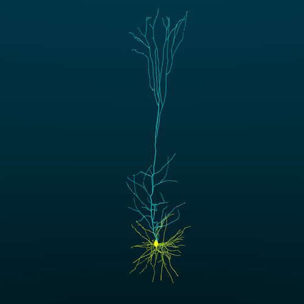
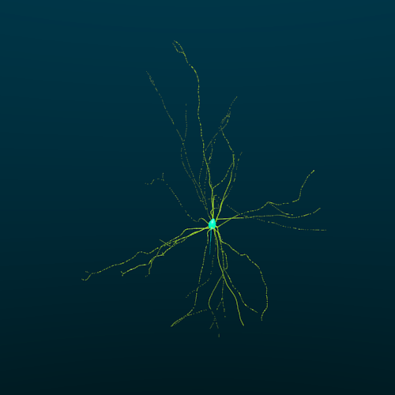
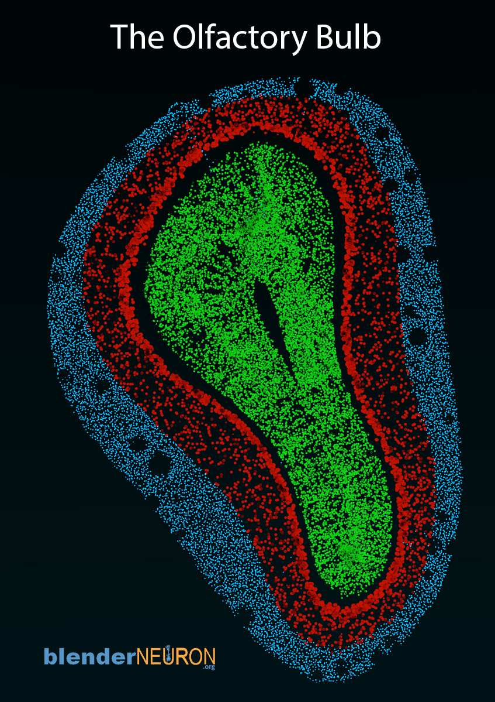

# BlenderNEURON

A Python package and an addon that takes a NEURON simulator model and exports its 3D structure and membrane activity to Blender. The export can be peformed via NEURON GUI or via Python commands.

## NEURON GUI

The tool is integrated with NEURON to provide a simple user interface and a set of Python commands that can be used to visualize and inspect single cell or network morphology and activity.

## Example Cells and Activity

|        |   |
|----------------------------------|----------------------------------|
| Neocortex Layer 5 Pyramidal Cell | Hippocampus CA1 Pyramidal Cell   |
|          |  |
| Cerebellum Purkinje Cell         | Neocortex Layer 5 Basket Cell    |

## Example Networks
Example visualization of Traub et. al. (2005) cortical column model, also showing a model of a nano-fabricated electrode:

Virtual slices can be created by manipulating Blender's camera clipping distances. An example of a virtual slice of an olfcatory bulb model (colors represend different cell types):

Example visualizations of an olfactory bulb model (Migliore et. al. 2014).

A network of about 60 mitral cells

3D structure and activity of a 5 mitral cell network and several accompanying granule cells

Activity of 1 mitral cell with several hundred companion granule cells

## Blender GUI:

## Documentation
Instructions for how to install and use BlenderNEURON can be found here: [BlenderNEURON Documentation](http://blenderneuron.org/docs)

